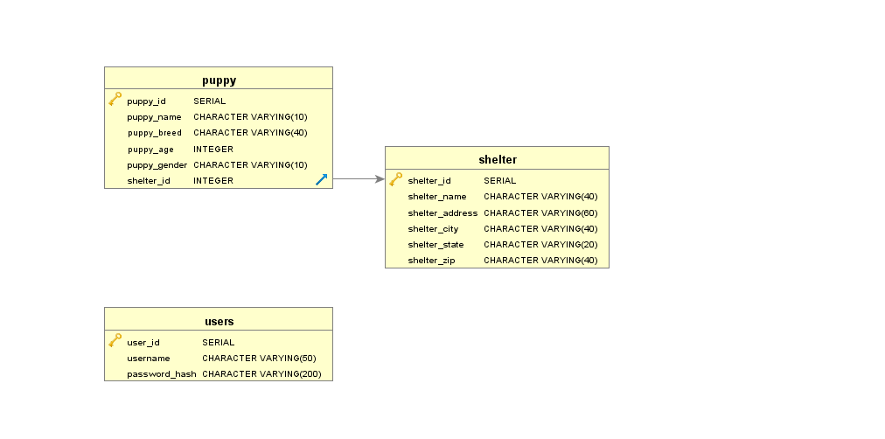

# Module 2 Final Review -- Puppies and Shelter Application

You are creating a shelter and puppy application.  The user should register and then log in.  Only registered users may view the shelter menu.

Only admins may adopt (delete) a dog from the database.

## Database Schema

### Users table

The `users` table stores the login information for users of the system.

| Field           | Description                                                                    |
| --------------- | ------------------------------------------------------------------------------ |
| `user_id`       | Unique identifier of the user                                                  |
| `username`      | String that identifies the name of the user; used as part of the login process |
| `password_hash` | Hashed version of the user's password                                          |

### Shelter table

The `shelter` table stores the list of shelters in the system.

| Field            | Description                                                        |
| ---------------- | ------------------------------------------------------------------ |
| `shelter_id`     | Unique identifier of the shelter                                   |
| `shelter_name`   | Name of the shelter                                                |
| `shelter_address`| Street address of the shelter                                      |
| `shelter_city`   | City of the shelter                                                |
| `shelter_state`  | State of the shelter                                               |
| `shelter_zip`    | Zipcode of the shelter                                             |

### Puppy table

The `puppy` table stores all the puppies that are in the system.

| Field            | Description                                                        |
| ---------------- | ------------------------------------------------------------------ |
| `puppy_id`       | Unique identifier of the puppy                                     |
| `puppy_name`     | Name of the puppy                                                  |
| `puppy_breed`    | Breed of the puppy                                                 |
| `puppy age`      | Integer age of the puppy                                           |
| `puppy_gender`   | Gender of the puppy                                                |
| `shelter_id`     | id of the shelter where the puppy is                               |

## How to set up the database

In the database folder, you'll find the database creation scripts and a shell script called `create.sh`. Run `./create.sh` from the database folder in Bash to create the database.

## Authentication

The user registration and authentication functionality for the system has already been implemented. If you review the login code, you'll notice that after successful authentication, an instance of `AuthenticatedUser` is stored in the `currentUser` member variable of `App`. The user's authorization token—meaning JWT—can be accessed from `App` as `currentUser.getToken()`. When the use cases above refer to an "authenticated user", this means a request that includes the token as a header. You can also reference other information about the current user by using the `User` object retrieved from `currentUser.getUser()`.